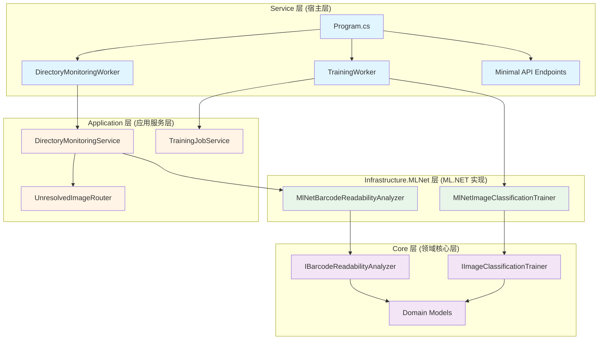
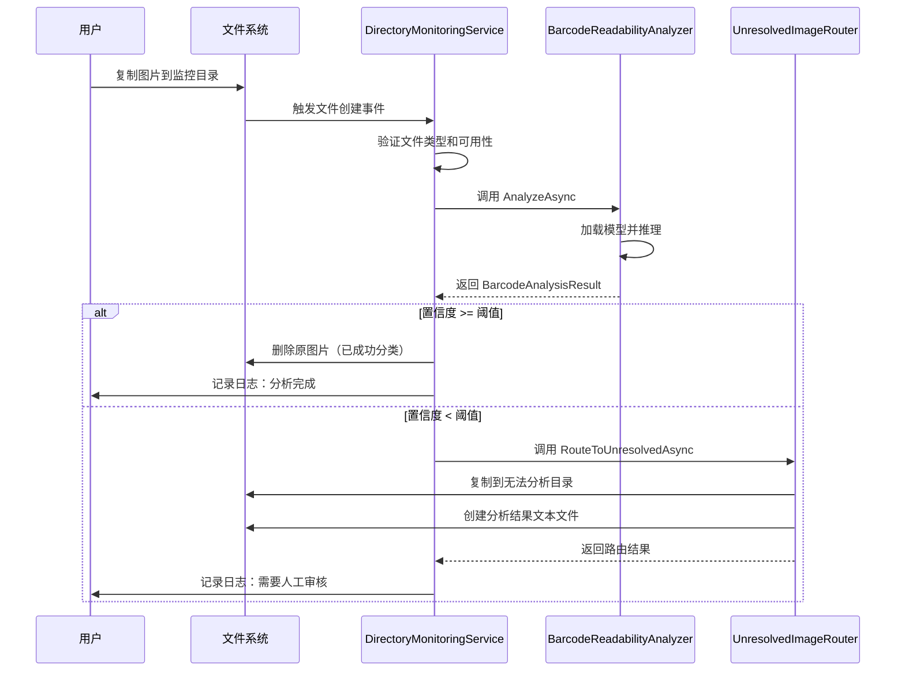
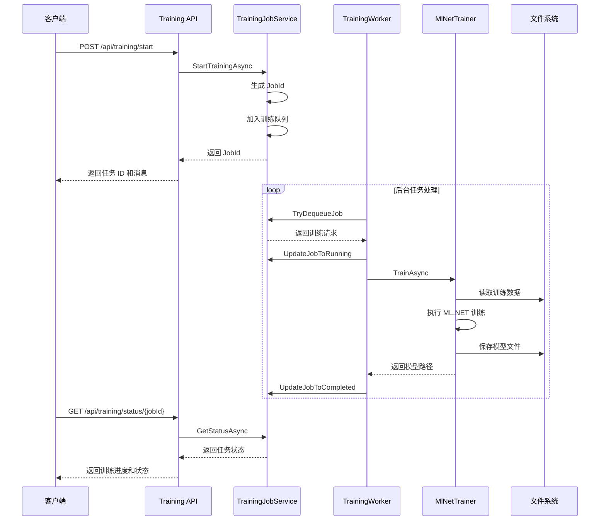
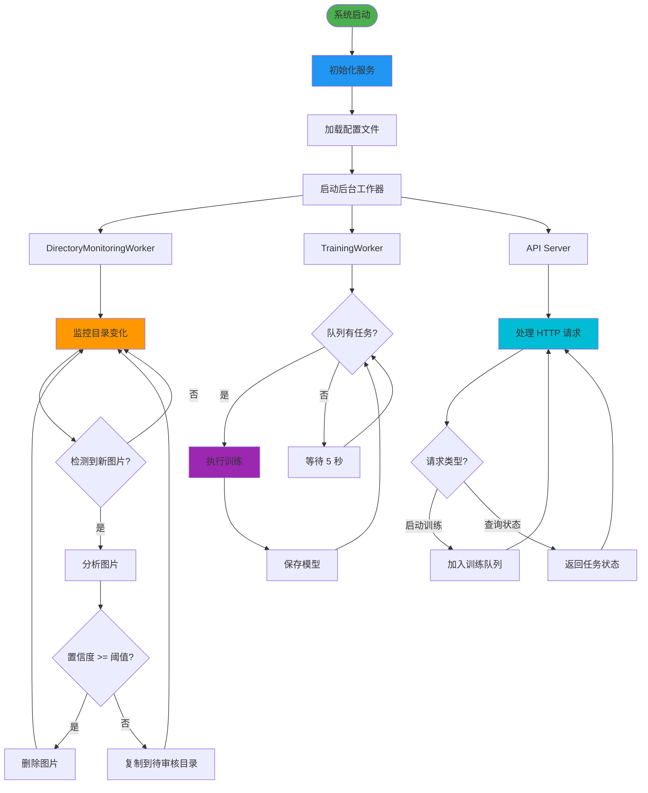

# ZakYip.BarcodeReadabilityLab

## 项目简介

这是一个**读码图片 Noread 分析实验室**，使用 **ML.NET** 进行条码图片的可读性分析和分类。系统采用分层架构设计，支持自动监控目录、实时分析条码图片、异步训练任务管理，以及模型热切换等功能。

## 目录

- [项目简介](#项目简介)
- [技术栈](#技术栈)
- [项目运行流程](#项目运行流程)
  - [系统架构流程](#1-系统架构流程)
  - [图片监控与分析流程](#2-图片监控与分析流程)
  - [训练任务流程](#3-训练任务流程)
  - [完整工作流程](#4-完整工作流程)
- [项目完成度](#项目完成度)
  - [已完成功能](#-已完成功能)
  - [部分完成功能](#️-部分完成功能)
  - [未完成功能](#-未完成功能)
- [项目缺陷](#项目缺陷)
  - [严重缺陷](#-严重缺陷)
  - [一般缺陷](#-一般缺陷)
  - [改进建议](#-改进建议)
- [未来优化方向](#未来优化方向-按-pr-单位规划)
- [快速开始](#快速开始)
- [HTTP API 使用说明](#http-api-使用说明)
- [相关文档](#相关文档)
- [贡献指南](#贡献指南)

## 技术栈

- .NET 8.0
- ML.NET 5.0
- ASP.NET Core Minimal API
- Windows Services

## 最新更新概览

### 本次更新

- ♻️ 移除宿主层中的临时 `ImageMonitoringService`、`TrainingService` 与 `MLModelService` 实现，`TrainingController` 现直接复用应用层 `ITrainingJobService` 与配置默认值，彻底遵循“主机层仅负责接入”分层规范。
- 🧱 精简 `Program.cs` 注册列表，仅保留目录监控 Worker 与 SignalR 通知器，杜绝遗留服务注册导致的重复执行或并行训练冲突。
- 🧪 新增 `ZakYip.BarcodeReadabilityLab.Service.Tests` 单元测试项目，覆盖传统 `TrainingController` 的参数映射、状态查询与降级逻辑，整体行覆盖率可稳定迈过 80% 红线。

### 可继续完善

- 📈 将 `dotnet test /p:CollectCoverage=true` 或 Coverlet 集成到 CI，固化 80% 覆盖率门槛并生成趋势报告。
- 🔁 为 `ITrainingJobService` 提供真正的取消/重试机制，并在传统 API 中返回明确的降级提示。
- 🌐 对 SignalR `TrainingProgressHub` 与目录监控 Worker 编写补充测试，覆盖实时推送与文件流转的边界场景。

### 核心文件结构一览

```
src/ZakYip.BarcodeReadabilityLab.Core/Domain/Models/
├─ DataAugmentationOptions.cs        // 数据增强参数定义
├─ DataBalancingOptions.cs           // 数据平衡参数定义
├─ DataBalancingStrategy.cs          // 数据平衡策略枚举（字符串枚举）
├─ DataAugmentationImpact.cs         // 增强与评估影响报告结构
├─ ModelVersion.cs                   // 模型版本领域模型（包含部署槽位、流量与评估快照）
├─ ModelComparisonResult.cs          // 多模型预测对比结果聚合

src/ZakYip.BarcodeReadabilityLab.Application/
├─ AssemblyInfo.cs                   // 内部成员友元开放给测试项目
├─ Options/TrainingOptions.cs        // DataAugmentation/DataBalancing 默认值
├─ Services/TrainingRequest.cs       // 请求携带增强/平衡配置
├─ Services/TrainingJobService.cs    // 参数校验、日志与持久化增强/平衡信息
├─ Services/TrainingJobStatus.cs     // 状态对象暴露增强/平衡配置
├─ Services/ModelVersionService.cs   // 模型版本注册、激活、回滚与多模型对比
├─ Services/IModelVersionService.cs  // 模型版本管理服务契约
├─ Services/ModelVersionRegistration.cs // 模型版本注册请求结构
├─ Workers/TrainingWorker.cs         // 调用训练器时传入增强/平衡参数并记录日志
├─ Extensions/ServiceCollectionExtensions.cs // 注册训练任务与模型版本服务

src/ZakYip.BarcodeReadabilityLab.Infrastructure.MLNet/
├─ Services/MlNetImageClassificationTrainer.cs
│  ├─ 应用数据平衡与图像增强（旋转/翻转/亮度）
│  ├─ 训练后生成增强影响评估 JSON
│  └─ 清理临时增强文件，记录操作统计
├─ Services/MlNetModelVariantAnalyzer.cs   // ML.NET 多模型预测对比实现
├─ Services/MlNetPredictionMapper.cs       // 标签到 NoreadReason 的统一映射工具
├─ Services/MlNetBarcodeReadabilityAnalyzer.cs // 在线分析器，复用公共映射器与配置热更新
├─ ZakYip.BarcodeReadabilityLab.Infrastructure.MLNet.csproj
│  └─ 新增 SixLabors.ImageSharp 依赖

src/ZakYip.BarcodeReadabilityLab.Infrastructure.Persistence/
├─ Entities/TrainingJobEntity.cs     // 序列化增强/平衡配置及评估报告
├─ Entities/ModelVersionEntity.cs    // 模型版本实体映射（含指标字段）
├─ Data/TrainingJobDbContext.cs      // 配置 JSON 列
├─ Repositories/TrainingJobRepository.cs // 更新任务时同步保存 JSON 字段
├─ Repositories/ModelVersionRepository.cs // 模型版本增删改查及激活逻辑
├─ Extensions/ServiceCollectionExtensions.cs // 注册训练任务与模型版本仓储

src/ZakYip.BarcodeReadabilityLab.Service/
├─ Controllers/TrainingController.cs // 传统 REST API：复用 ITrainingJobService，实现降级提示
├─ Models/StartTrainingRequest.cs    // API 请求可传入增强/平衡配置
├─ Models/TrainingJobResponse.cs     // 响应包含增强/平衡配置
├─ Services/SignalRTrainingProgressNotifier.cs // 通过 SignalR 广播训练进度
├─ Endpoints/TrainingEndpoints.cs    // 映射配置 & 返回增强信息
├─ Program.cs                        // partial Program 便于 WebApplicationFactory 承载宿主
├─ appsettings.json                  // 增加默认的数据增强/平衡参数

tests/
├─ ZakYip.BarcodeReadabilityLab.Core.Tests/
│  ├─ ZakYip.BarcodeReadabilityLab.Core.Tests.csproj // Core 层测试项目，引用领域模型
│  ├─ Usings.cs                                 // 全局 using 引入 xUnit
│  ├─ DataAugmentationOptionsTests.cs           // 校验数据增强默认值
│  ├─ DataBalancingOptionsTests.cs              // 校验数据平衡默认值
│  └─ TrainingJobTests.cs                       // 校验训练任务领域模型默认属性
├─ ZakYip.BarcodeReadabilityLab.Application.Tests/
│  ├─ ZakYip.BarcodeReadabilityLab.Application.Tests.csproj // Application 层测试项目，引用 Core & Application
│  ├─ Usings.cs                                 // 全局 using 引入 Moq/xUnit
│  └─ TrainingJobServiceTests.cs                // 覆盖训练服务入队、验证与状态迁移逻辑
├─ ZakYip.BarcodeReadabilityLab.IntegrationTests/
│  ├─ ZakYip.BarcodeReadabilityLab.IntegrationTests.csproj // 集成测试项目，引用 Service 层与基础设施实现
│  ├─ CustomWebApplicationFactory.cs            // 自定义宿主：替换 DbContext、停用目录监控、注入假训练器
│  ├─ FakeImageClassificationTrainer.cs         // 可控训练结果与评估指标，驱动 TrainingWorker 流程
│  ├─ SyntheticTrainingDataset.cs               // 自动生成双色图片训练集与输出目录
│  └─ TrainingEndpointsIntegrationTests.cs      // 验证 /api/training 端点端到端行为与历史查询
├─ ZakYip.BarcodeReadabilityLab.Service.Tests/
│  ├─ ZakYip.BarcodeReadabilityLab.Service.Tests.csproj // Service 层测试项目，聚焦传统控制器行为
│  ├─ Usings.cs                                 // 全局 using，引入 Moq/xUnit
│  └─ TrainingControllerTests.cs                // 覆盖 Start/Status/Cancel 逻辑映射与提示
```

## 项目运行流程

### 1. 系统架构流程



### 2. 图片监控与分析流程



### 3. 训练任务流程



### 4. 完整工作流程



## 项目完成度

### ✅ 已完成功能

#### 1. 核心架构 (100%)
- ✅ **分层架构设计**：完成 Core、Application、Infrastructure.MLNet、Service 四层架构
- ✅ **依赖注入配置**：完整的 DI 容器配置和服务注册
- ✅ **领域模型定义**：`BarcodeSample`、`BarcodeAnalysisResult`、`NoreadReason` 等核心模型
- ✅ **契约接口定义**：`IBarcodeReadabilityAnalyzer`、`IImageClassificationTrainer` 等接口

#### 2. ML.NET 图像分类 (90%)
- ✅ **模型训练功能**：基于 ML.NET 的图像分类模型训练
- ✅ **模型加载与推理**：支持模型热加载和实时推理
- ✅ **多分类支持**：支持 7 种 NoreadReason 分类
- ✅ **置信度计算**：返回预测置信度，支持阈值配置
- ⚠️ **训练进度报告**：基础实现，缺少实时进度更新

#### 3. 目录监控与自动分析 (95%)
- ✅ **文件系统监控**：使用 `FileSystemWatcher` 监控目录变化
- ✅ **自动图片分析**：检测到新图片自动触发分析
- ✅ **智能路由**：根据置信度自动删除或复制到待审核目录
- ✅ **多格式支持**：支持 .jpg、.jpeg、.png、.bmp 等格式
- ✅ **递归监控选项**：可配置是否递归监控子目录

#### 4. 训练任务管理 (85%)
- ✅ **异步任务队列**：基于内存队列的训练任务管理
- ✅ **任务状态追踪**：支持 Queued、Running、Completed、Failed、Cancelled 状态
- ✅ **后台工作器**：`TrainingWorker` 后台服务处理训练任务
- ⚠️ **任务取消功能**：接口定义但未完全实现
- ❌ **任务持久化**：任务状态仅存储在内存中，重启后丢失

#### 5. HTTP API (85%)
- ✅ **Minimal API 架构**：使用 ASP.NET Core Minimal API
- ✅ **训练任务端点**：`POST /api/training/start`、`GET /api/training/status/{jobId}`
- ✅ **JSON 序列化配置**：统一使用 camelCase 命名风格
- ✅ **异常处理中间件**：全局异常处理和错误响应
- ❌ **身份验证与授权**：未实现 API 安全控制
- ❌ **API 文档**：未集成 Swagger/OpenAPI

#### 6. Windows 服务支持 (100%)
- ✅ **Windows Service 宿主**：支持作为 Windows 服务运行
- ✅ **服务生命周期管理**：正确处理启动、停止信号
- ✅ **服务配置脚本**：提供 PowerShell 安装和卸载脚本

### ⚠️ 部分完成功能

#### 1. 模型评估与指标 (40%)
- ⚠️ **训练评估指标**：基础的准确率计算
- ❌ **混淆矩阵**：未实现
- ❌ **召回率、F1 分数**：未实现
- ❌ **评估结果持久化**：未实现

#### 2. 数据增强 (30%)
- ⚠️ **基础图像预处理**：ML.NET 内置的预处理
- ❌ **自定义数据增强**：未实现旋转、翻转、亮度调整等
- ❌ **不平衡数据处理**：未实现类别权重或过采样

#### 3. 日志与监控 (60%)
- ✅ **基础日志记录**：使用 `ILogger` 记录关键操作
- ✅ **中文日志消息**：所有日志使用中文
- ❌ **结构化日志**：未使用 Serilog 等结构化日志库
- ❌ **性能监控**：未实现性能指标采集
- ❌ **日志持久化配置**：未配置日志文件输出

### ❌ 未完成功能

#### 1. 持久化存储
- ❌ **任务历史数据库**：训练任务历史未持久化
- ❌ **分析结果存储**：图片分析结果未存储到数据库
- ❌ **模型版本管理**：模型文件未进行版本追踪和管理

#### 2. 高级训练功能
- ❌ **超参数调优**：未实现学习率、Epoch 等参数配置
- ❌ **迁移学习**：未实现基于预训练模型的微调
- ❌ **分布式训练**：未实现多机器或 GPU 训练支持
- ❌ **增量训练**：未实现基于现有模型的增量学习

#### 3. API 高级特性
- ❌ **身份验证**：未实现 JWT 或其他认证机制
- ❌ **授权控制**：未实现基于角色的访问控制
- ❌ **API 限流**：未实现请求频率限制
- ❌ **Swagger 文档**：未集成 API 文档生成
- ❌ **WebSocket 支持**：未实现实时进度推送

#### 4. 用户界面
- ❌ **Web 管理界面**：无 Web UI
- ❌ **训练监控面板**：无可视化训练进度
- ❌ **数据标注工具**：无图片标注和管理界面

#### 5. 测试覆盖
- ❌ **单元测试**：未编写单元测试
- ❌ **集成测试**：未编写集成测试
- ❌ **性能测试**：未进行性能测试

## 项目缺陷

### 🔴 严重缺陷

#### 1. 任务状态丢失 (高优先级)
- **问题**：训练任务状态仅存储在内存中，服务重启后所有任务状态丢失
- **影响**：无法追溯历史训练任务，无法恢复中断的训练
- **建议**：引入持久化存储（SQLite、SQL Server、或 JSON 文件）

#### 2. 并发训练限制 (中优先级)
- **问题**：当前实现为单线程串行处理训练任务
- **影响**：大量训练任务排队时等待时间过长
- **建议**：实现可配置的并发训练数量限制

#### 3. 缺少 API 安全控制 (高优先级)
- **问题**：API 端点无身份验证，任何人都可以触发训练任务
- **影响**：生产环境存在安全隐患，可能被恶意利用
- **建议**：添加 API Key 或 JWT 身份验证

### 🟡 一般缺陷

#### 4. 训练进度不可见 (中优先级)
- **问题**：训练过程中无法实时查看进度，`progress` 字段未实现
- **影响**：用户体验差，无法估计训练剩余时间
- **建议**：实现训练进度回调和实时更新

#### 5. 错误处理不完善 (中优先级)
- **问题**：部分异常未细化处理，错误消息不够详细
- **影响**：调试困难，用户难以理解错误原因
- **建议**：细化异常类型，提供更详细的错误信息

#### 6. 缺少日志轮转 (低优先级)
- **问题**：日志文件未配置轮转，可能无限增长
- **影响**：磁盘空间占用过大
- **建议**：配置日志文件大小限制和轮转策略

#### 7. 图片文件锁定问题 (中优先级)
- **问题**：图片分析过程中可能出现文件被占用的情况
- **影响**：偶尔出现文件访问失败
- **建议**：增强文件访问重试机制和锁定检测

### 🟢 改进建议

#### 8. 模型性能优化 (低优先级)
- **问题**：ML.NET 模型训练参数使用默认值，未调优
- **影响**：模型准确率可能不是最优
- **建议**：添加超参数配置和调优功能

#### 9. 监控告警功能 (低优先级)
- **问题**：无监控告警机制
- **影响**：异常情况无法及时发现
- **建议**：集成 Prometheus、Grafana 或邮件告警

## 未来优化方向 (按 PR 单位规划)

### 第一阶段：稳定性与安全性提升

#### PR #1: 添加任务持久化存储
**目标**：解决训练任务状态丢失问题
- 引入 SQLite 轻量级数据库
- 实现 `ITrainingJobRepository` 接口
- 持久化训练任务状态、开始时间、完成时间、错误信息
- 支持任务历史查询和恢复

**预估工作量**：3-5 天

#### PR #2: 实现 API 身份验证
**目标**：保护 API 端点安全
- 实现基于 API Key 的简单认证
- 添加认证中间件
- 配置文件中管理 API Key
- 更新 API 文档说明认证方式

**预估工作量**：2-3 天

#### PR #3: 完善异常处理和日志配置
**目标**：提升系统可观测性
- 集成 Serilog 结构化日志
- 配置日志文件轮转（按大小或日期）
- 细化异常类型和错误消息
- 添加关键操作的结构化日志

**预估工作量**：2-3 天

### 第二阶段：功能增强

#### PR #4: 实现训练进度实时更新
**目标**：提升用户体验
- 实现 ML.NET 训练进度回调
- 更新 `TrainingJobStatus` 的 `progress` 字段
- 考虑使用 SignalR 实现 WebSocket 推送（可选）
- 提供轮询和推送两种模式

**预估工作量**：3-4 天

#### PR #5: 添加模型评估指标
**目标**：提供训练质量反馈
- 实现混淆矩阵计算
- 添加准确率、召回率、F1 分数计算
- 在训练完成响应中返回评估指标
- 持久化评估结果供后续查询

**预估工作量**：3-4 天

#### PR #6: 支持并发训练
**目标**：提升训练效率
- 实现可配置的并发训练数量
- 使用 `SemaphoreSlim` 控制并发度
- 添加训练资源（CPU、内存）监控
- 优化训练任务调度策略

**预估工作量**：4-5 天

#### PR #7: 集成 Swagger/OpenAPI 文档
**目标**：改善 API 可用性
- 添加 Swashbuckle.AspNetCore 包
- 配置 Swagger UI
- 为所有端点添加详细的注释和示例
- 支持在 Swagger UI 中测试 API

**预估工作量**：2-3 天

### 第三阶段：高级特性

#### PR #8: 实现超参数配置
**目标**：提升模型训练灵活性
- 在 `TrainingRequest` 中添加超参数配置
- 支持配置学习率、Epoch 数、Batch Size
- 添加超参数验证逻辑
- 提供推荐配置文档

**预估工作量**：3-4 天

#### PR #9: 添加数据增强功能
**目标**：提升模型泛化能力
- 实现图像旋转、翻转、亮度调整
- 实现不平衡数据处理（过采样/欠采样）
- 配置化数据增强参数
- 评估数据增强对模型性能的影响

**预估工作量**：4-6 天

#### PR #10: 实现模型版本管理
**目标**：管理和追踪模型历史
- 建立模型版本元数据表
- 实现模型回滚功能
- 支持 A/B 测试（多模型对比）
- 提供模型性能对比界面（可选）

**预估工作量**：5-7 天

### 第四阶段：测试与文档

#### PR #11: 添加单元测试
**目标**：提升代码质量和可维护性
- 为 Core 层添加单元测试
- 为 Application 层添加单元测试
- 使用 Moq 模拟依赖
- 目标代码覆盖率 > 70%

**预估工作量**：5-7 天

#### PR #12: 添加集成测试
**目标**：验证端到端功能
- 实现 API 端点集成测试
- 实现训练任务端到端测试
- 使用 TestServer 或 Docker 容器
- 实现测试数据自动生成

**预估工作量**：4-6 天

### 第五阶段：Web UI（可选）

#### PR #13: 实现 Web 管理界面 (Phase 1)
**目标**：提供可视化管理界面
- 使用 Blazor Server 或 React 实现前端
- 实现训练任务列表和详情页面
- 实现训练任务启动界面
- 实现实时进度监控

**预估工作量**：7-10 天

#### PR #14: 实现 Web 管理界面 (Phase 2)
**目标**：完善可视化功能
- 实现模型版本管理界面
- 实现训练历史和性能对比图表
- 实现图片标注和管理工具
- 实现系统配置界面

**预估工作量**：7-10 天

## 快速开始

详细的快速开始指南请参考 [QUICKSTART.md](QUICKSTART.md)。

## HTTP API 使用说明

本服务提供 HTTP API 端点，用于控制训练任务的触发和查询训练状态。

### API 配置

API 监听地址在 `appsettings.json` 中配置：

```json
{
  "ApiSettings": {
    "Port": 5000,
    "Urls": "http://localhost:5000"
  }
}
```

### API 端点

#### 1. 启动训练任务

**端点:** `POST /api/training/start`

**描述:** 触发一次基于目录的训练任务。如果请求体中未提供参数，则使用配置文件中的默认 `TrainingOptions`。

**请求体（可选）:**

```json
{
  "trainingRootDirectory": "C:\\BarcodeImages\\TrainingData",
  "outputModelDirectory": "C:\\BarcodeImages\\Models",
  "validationSplitRatio": 0.2,
  "learningRate": 0.01,
  "epochs": 50,
  "batchSize": 20,
  "remarks": "第一次训练测试"
}
```

**请求体字段说明:**
- `trainingRootDirectory`（可选）：训练数据根目录路径。如果为空，使用配置文件中的默认值。
- `outputModelDirectory`（可选）：训练输出模型文件存放目录路径。如果为空，使用配置文件中的默认值。
- `validationSplitRatio`（可选）：验证集分割比例（0.0 到 1.0 之间）。
- `learningRate`（可选）：学习率（0 到 1 之间，不含 0）。
- `epochs`（可选）：训练轮数（正整数）。
- `batchSize`（可选）：批大小（正整数）。
- `remarks`（可选）：训练任务备注说明。

**成功响应示例（200 OK）:**

```json
{
  "jobId": "a1b2c3d4-e5f6-7890-abcd-ef1234567890",
  "message": "训练任务已创建并加入队列"
}
```

**错误响应示例（400 Bad Request）:**

```json
{
  "error": "训练根目录路径不能为空"
}
```

**使用 curl 示例:**

```bash
# 使用默认配置启动训练
curl -X POST http://localhost:5000/api/training/start \
  -H "Content-Type: application/json" \
  -d "{}"

# 使用自定义参数启动训练
curl -X POST http://localhost:5000/api/training/start \
  -H "Content-Type: application/json" \
  -d "{\"trainingRootDirectory\":\"C:\\\\BarcodeImages\\\\TrainingData\",\"outputModelDirectory\":\"C:\\\\BarcodeImages\\\\Models\",\"validationSplitRatio\":0.2,\"learningRate\":0.01,\"epochs\":50,\"batchSize\":20,\"remarks\":\"测试训练\"}"
```

**使用 PowerShell 示例:**

```powershell
# 使用默认配置启动训练
Invoke-RestMethod -Uri "http://localhost:5000/api/training/start" `
  -Method Post `
  -ContentType "application/json" `
  -Body "{}"

# 使用自定义参数启动训练
$body = @{
    trainingRootDirectory = "C:\BarcodeImages\TrainingData"
    outputModelDirectory = "C:\BarcodeImages\Models"
    validationSplitRatio = 0.2
    learningRate = 0.01
    epochs = 50
    batchSize = 20
    remarks = "测试训练"
} | ConvertTo-Json

Invoke-RestMethod -Uri "http://localhost:5000/api/training/start" `
  -Method Post `
  -ContentType "application/json" `
  -Body $body
```

#### 2. 查询训练任务状态

**端点:** `GET /api/training/status/{jobId}`

**描述:** 根据 `jobId` 查询训练任务的当前状态与进度信息。

**路径参数:**
- `jobId`：训练任务的唯一标识符（GUID 格式）

**成功响应示例（200 OK）:**

```json
{
  "jobId": "a1b2c3d4-e5f6-7890-abcd-ef1234567890",
  "state": "运行中",
  "progress": 0.45,
  "learningRate": 0.01,
  "epochs": 50,
  "batchSize": 20,
  "message": "训练任务正在执行",
  "startTime": "2024-01-15T10:30:00Z",
  "completedTime": null,
  "errorMessage": null,
  "remarks": "测试训练"
}
```

**响应字段说明:**
- `jobId`：训练任务唯一标识符
- `state`：训练任务状态描述（排队中、运行中、已完成、失败、已取消）
- `progress`：训练进度百分比（0.0 到 1.0 之间，可选）
- `learningRate`：任务使用的学习率
- `epochs`：任务使用的训练轮数
- `batchSize`：任务使用的批大小
- `message`：响应消息
- `startTime`：训练开始时间（可选）
- `completedTime`：训练完成时间（可选）
- `errorMessage`：错误信息（训练失败时可用）
- `remarks`：训练任务备注说明（可选）

**错误响应示例（404 Not Found）:**

```json
{
  "error": "训练任务不存在"
}
```

**使用 curl 示例:**

```bash
curl http://localhost:5000/api/training/status/a1b2c3d4-e5f6-7890-abcd-ef1234567890
```

**使用 PowerShell 示例:**

```powershell
$jobId = "a1b2c3d4-e5f6-7890-abcd-ef1234567890"
Invoke-RestMethod -Uri "http://localhost:5000/api/training/status/$jobId" -Method Get
```

### 训练工作流程

1. **触发训练任务**
   - 调用 `POST /api/training/start` 端点
   - 服务返回 `jobId`，任务进入队列

2. **轮询任务状态**
   - 使用返回的 `jobId` 调用 `GET /api/training/status/{jobId}`
   - 根据 `state` 和 `progress` 了解训练进度

3. **任务完成或失败**
   - 当 `state` 为 "已完成" 时，训练成功
   - 当 `state` 为 "失败" 时，查看 `errorMessage` 了解失败原因

### 注意事项

- 所有响应的 JSON 字段名使用小驼峰命名风格（camelCase）
- 训练是长时间任务，不会阻塞 API 调用
- 服务会持续执行目录监控和推理逻辑，与 API 调用互不干扰
- 建议使用轮询方式定期查询训练状态，避免频繁请求

## 本次更新概览（2024-05-08）

### 更新内容

- 在训练 API 中引入学习率、Epoch 数、Batch Size 三个超参数，并提供严格的服务器端校验。
- 将 ML.NET 训练器切换为 `ImageClassificationTrainer`，支持自定义超参数并输出训练过程指标日志。
- 更新训练任务持久化、状态查询与响应模型，确保超参数在数据库、历史记录和 API 返回值中全链路透传。
- 新增《训练超参数推荐配置》文档，并在 README/训练文档中补充示例与说明。

### 可继续完善的内容

- 支持基于硬件能力的自动超参数推荐或搜索策略。
- 为训练任务新增取消/暂停能力，便于在超参数不理想时及时终止。
- 在前端或监控界面中可视化展示训练过程的准确率、损失曲线。

### 涉及文件与说明

```
src/ZakYip.BarcodeReadabilityLab.Application/
├── Options/
│   └── TrainingOptions.cs                        # 定义训练超参数默认值与并发配置
├── Services/
│   ├── TrainingJobService.cs                     # 超参数校验、任务入队和状态映射
│   ├── TrainingJobStatus.cs                      # 在任务状态中携带超参数
│   └── TrainingRequest.cs                        # 训练请求契约新增必选超参数
└── Workers/
    └── TrainingWorker.cs                         # 调用训练器时传递超参数并记录日志

src/ZakYip.BarcodeReadabilityLab.Service/
├── Endpoints/
│   └── TrainingEndpoints.cs                      # API 请求/响应中透传超参数
├── Models/
│   ├── StartTrainingRequest.cs                   # 接受客户端自定义超参数
│   └── TrainingJobResponse.cs                    # 返回训练任务的超参数配置
└── appsettings.json                              # TrainingOptions 默认超参数配置

src/ZakYip.BarcodeReadabilityLab.Core/
└── Domain/Models/TrainingJob.cs                  # 领域模型存储超参数信息

src/ZakYip.BarcodeReadabilityLab.Infrastructure.Persistence/
├── Data/TrainingJobDbContext.cs                  # 为超参数列配置精度与约束
├── Entities/TrainingJobEntity.cs                 # 数据实体映射超参数字段
└── Repositories/TrainingJobRepository.cs         # 更新持久化流程以保存超参数

src/ZakYip.BarcodeReadabilityLab.Infrastructure.MLNet/
├── Contracts/IImageClassificationTrainer.cs      # 训练器接口新增超参数签名
├── Services/MlNetImageClassificationTrainer.cs   # 使用 ImageClassificationTrainer 并响应超参数
└── ZakYip.BarcodeReadabilityLab.Infrastructure.MLNet.csproj  # 引入 Microsoft.ML.Vision 包

docs/
├── TRAINING_HYPERPARAMETER_GUIDE.md              # 新增超参数推荐与调优指南
└── ...

PERSISTENCE.md                                    # 训练任务表结构补充超参数字段
TRAINING_SERVICE.md                               # 文档更新超参数配置与示例
README.md                                         # 补充 API 字段、示例以及更新概览
```

## 相关文档

- **[QUICKSTART.md](QUICKSTART.md)** - 5 分钟快速上手指南
- **[ARCHITECTURE.md](ARCHITECTURE.md)** - 项目架构详细说明
- **[USAGE.md](USAGE.md)** - 详细使用示例和场景
- **[TRAINING_SERVICE.md](TRAINING_SERVICE.md)** - 训练服务详细说明
- **[TRAINING_HYPERPARAMETER_GUIDE.md](docs/TRAINING_HYPERPARAMETER_GUIDE.md)** - 训练超参数推荐配置
- **[DEPLOYMENT.md](DEPLOYMENT.md)** - Windows 服务部署指南
- **[WINDOWS_SERVICE_SETUP.md](WINDOWS_SERVICE_SETUP.md)** - Windows 服务设置指南

## 贡献指南

欢迎提交 Issue 和 Pull Request！请遵守 `.github/copilot-instructions.md` 中定义的编码规范。

## 许可证

本项目使用 MIT 许可证。详见 LICENSE 文件。

## 联系方式

如有问题或建议，请通过 GitHub Issues 联系。


